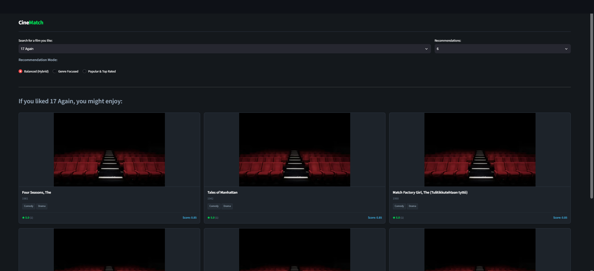

# CineMatch: Hybrid Movie Recommendation System

CineMatch is an interactive web application that provides personalized movie recommendations by combining content-based filtering (TF-IDF vectorization on movie genres) with collaborative filtering signals (normalized user ratings and vote counts).

---

##  Key Features

- **Hybrid Engine Logic:** Combines content similarity matrix calculations with historical popularity and user ratings.
- **Dynamic Algorithm Presets:** Toggle instantly between three tailored profiles:
  - **Balanced (Hybrid):** 50% Content / 50% Collaborative Weighting.
  - **Genre Focused:** 85% Content / 15% Collaborative Weighting.
  - **Popular & Top Rated:** 15% Content / 85% Collaborative Weighting.
- **Dynamic UI & Posters:** Built with Streamlit in a responsive dark grid layout, featuring dynamic poster retrieval via TMDB API integration with graceful fallback handling.

---

## 📸 Demonstration Interface

---

## 📁 Repository Structure

- `README.md` — Project documentation
- `RecommendationSystem.ipynb` — Data preparation, EDA, TF-IDF vectorization & hybrid modeling
- `app.py` — Streamlit application script & frontend UI
- `app_demo.png` — Interface screenshot preview
- `requirements.txt` — Python dependencies for deployment

---

## 🛠️ Local Setup Instructions

1. **Clone the repository:**
   `git clone https://github.com/Tehreem31/CineMatch-Movie-Recommender.git`
   `cd CineMatch-Movie-Recommender`

2. **Install dependencies:**
   `pip install -r requirements.txt`

3. **Launch the application:**
   `streamlit run app.py`
